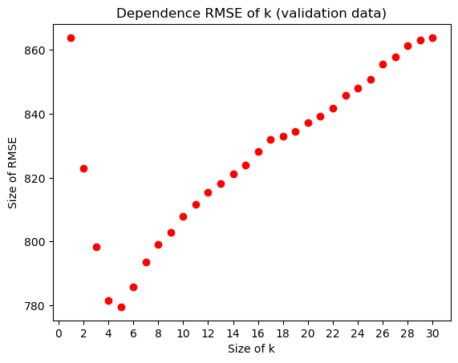

# K-nearest neighbors method in forecasting power consumption in the national power system

## Authors
- [Grzegorz Smereczniak](https://github.com/smereczniaq)

This project utilizes the K-nearest neighbors (KNN) algorithm to predict power consumption for a specified hour based on the power consumption data from the preceding 168 hours. The dataset used in this project has been downloaded from the website [https://www.pse.pl/dane-systemowe/funkcjonowanie-kse/raporty-dobowe-z-pracy-kse/zapotrzebowanie-mocy-kse](https://www.pse.pl/dane-systemowe/funkcjonowanie-kse/raporty-dobowe-z-pracy-kse/zapotrzebowanie-mocy-kse) and then preprocessed by the author.

## Tools Used
- Python
- Jupyter Notebook
- NumPy
- Pandas
- Matplotlib
- scikit-learn

## Functions

### read_and_group_dataset(file_path)
Splits the input file passed as an argument into three tables. One table contains data for the training set, the second one has data for the validation set, and the third one contains data for the test set.

### set_model(training_set)
Creates and fits a K-nearest neighbors regression model (KNeighborsRegressor) based on the provided training set. The method returns a ready-to-use K-nearest neighbors regression model that can be used to predict values for new data based on their neighbors in the training set.

### calculate_rmse_for_k(k_values)
Finds the mean squared error values for the validation set for different values of k passed as an argument to the method. Finally, it returns these values in the form of a table whose size depends on the number of investigated k values.

### find_min_k(mse_values)
Takes an array of mean squared error values depending on k as an argument and returns the value of k for which the mean squared error is the smallest.

### calculate_rmse_for_testing_data(model, test_set)
Calculates and returns the mean squared error value of predictions for the provided test set as an argument. To do this, it uses a model created with the previously determined k and the test set to determine the predicted power demand.

### find_k()
Utilizes the `calculate_rmse_for_k()` and `find_min_k()` methods to find the k value for which the power demand prediction model performs most accurately.

## Results
In the subsequent part of the code, the above-mentioned methods are utilized to determine the final value of k for which the model performs most accurately and the corresponding mean squared error for the test set. The optimal value of k, where the model performs the best, is k=5, and the mean squared error value is rmse = 903.0600272894059. As observed from the generated plot, the validation set exhibits the lowest error for k=5. Therefore, it can be concluded that the value of k to be used for evaluating the model on the test set is indeed k=5.

